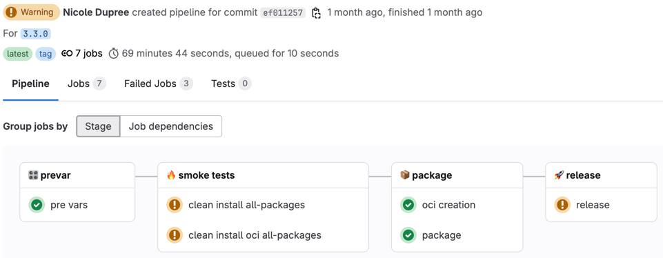
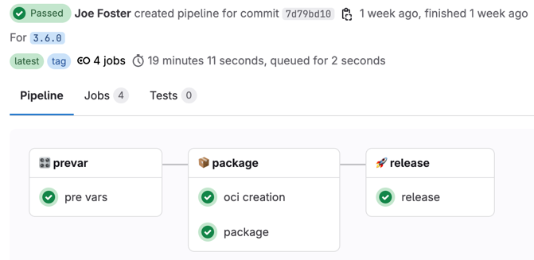
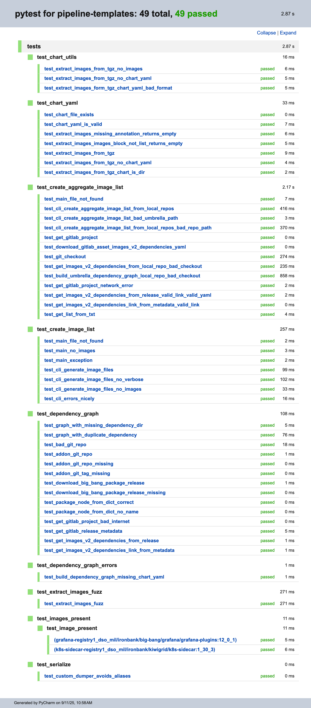

# New Methodology for images.txt, package-images.yaml, oci_package_list.txt, and Others

## BLUF

1. Big Bang image metadata now comes from explicit declarations (no more cluster scraping)
2. `images.txt` remains
3. New `images-v2-*` files add a dependency graph so you can pre-pull or allowlist exactly what you need—no Istio/Kyverno/Flux noise unless they are actual dependencies.
4. The `smoke tests` stage and its jobs (`clean install all-packages` and `clean install oci all-packages`) have been eliminated since each package is tested individually as part of the package pipeline.
5. The Big Bang release pipeline now completes in around 20 minutes rather than multiple hours, saving the release engineers considerable time on every release.

## Comparing Old and New Pipelines

[Old Release Pipeline Run for `3.3.0`](https://repo1.dso.mil/big-bang/bigbang/-/pipelines/4389354) (1:09:44)



And, because the `clean install all-packages` job failed regularly, this pipeline would typically need to be run 3–5
times for every release, bringing the total pipeline time (not including fixing) to approximately 4:39:56 on average.

[New Release Pipeline Run for `3.6.0`](https://repo1.dso.mil/big-bang/bigbang/-/pipelines/4495018) (0:19:11):



| Pipeline                  | Time            |            |
|---------------------------|-----------------|------------|
| Old (avg across 3-5 runs) | `4:39:56`       | ██████████ |
| New                       | `0:19:11`       | █          |
| **Savings**               | `4:20:45` (93%) |            |

That is a **93% savings in time** for every release!

## Terms / Glossary

Throughout this article, the terms core, umbrella, and Big Bang chart are all used interchangeably.

## Breaking Changes

None

## What changed and when?

The changes were introduced in [Big Bang 3.4.0](https://repo1.dso.mil/big-bang/bigbang/-/releases/3.4.0) on August
7, 2025.

The methodology used to compute the contents of the following files changed:

1. `images.txt`
2. `package-images.yaml`
3. `oci_package_list.txt`

Three (3) new files are being generated:

1. `images-v2-dependencies.yaml`
2. `images-v2-with-dependencies.txt`
3. `images-v2-no-dependencies.txt`

The old methodology spun up the package on a cluster and then pulled a list of all images running in the cluster,
whether they were for that package or not.
Therefore, the list of images contained references to Istio, Kyverno, Flux CD, the package of concern, and sometimes
more.
This was an implicit approach and led to an imprecise list of images.

The new methodology uses an explicit approach where all images are defined purposefully in the following locations:

| Source / Location                                                          | Key Path                       | Scope                 | Example                                                                                                                |
|----------------------------------------------------------------------------|--------------------------------|-----------------------|------------------------------------------------------------------------------------------------------------------------|
| Package's `chart/Chart.yaml`                                               | `annotations."helm.sh/images"` | `package`, `umbrella` | [Example](https://repo1.dso.mil/big-bang/product/packages/argocd/-/blob/8.3.4-bb.0/chart/Chart.yaml?ref_type=tags#L42) |
| Subcharts listed in `chart/Chart.yaml` that contain their own `Chart.yaml` | `annotations."helm.sh/images"` | `package`, `umbrella` |                                                                                                                        |
| Flux kustomization in `base/flux/kustomization.yaml`                       | `images`                       | `umbrella`            | [Example](https://repo1.dso.mil/big-bang/bigbang/-/blob/3.6.0/base/flux/kustomization.yaml?ref_type=tags#L6)           |
| Test images in `tests/images.txt`                                          | N/A                            | `umbrella`            | [Example](https://repo1.dso.mil/big-bang/bigbang/-/blob/3.6.0/tests/images.txt?ref_type=tags)                          |

If you are looking at the `images.txt` from a Big Bang release and you do not see the image you expect, it is likely not
explicitly defined in one of these locations.
If it is defined and you still do not see it, please
[create an issue](https://repo1.dso.mil/big-bang/bigbang/-/issues/new).

## What are the `images-v2-*` files and should I care about them?

1. `images-v2-dependencies.yaml`
2. `images-v2-with-dependencies.txt`
3. `images-v2-no-dependencies.txt`

These new files were created from the ground up to take a true dependency graph approach that will be fully leveraged in
the future.

See [an example of the `images-v2-dependencies.yaml` from the Big Bang 3.6.0 release](https://umbrella-bigbang-releases.s3-us-gov-west-1.amazonaws.com/umbrella/3.6.0/images-v2-dependencies.yaml).

The structure is self-explanatory, but notice that the top level item is a
[`PackageNode`](https://repo1.dso.mil/big-bang/pipeline-templates/pipeline-templates/-/blob/2.24.16/scripts/pipeline/src/ci/dependency_graph.py?ref_type=tags#L22)
and has the following fields:

| Variable            | Type                |
|---------------------|---------------------|
| `name`              | `str`               |
| `version`           | `str`               |
| `images`            | `list[str]`         |
| `subChartImages`    | `list[str]`         |
| `dependentPackages` | `list[PackageNode]` |

`dependentPackages` is a list of `PackageNode` objects which can be nested recursively as the dependency graph is
fleshed out.

For the moment, while the dependency graph is only one (1) level deep, the YAML will be relatively flat. However, once
the additional metadata is added to each package, the dependency graph can go as deep as needed to reflect the
dependencies.
For example, `alloy` is dependent on `monitoring` which is dependent on `core`.

Now that it is understood that dependencies may be many levels deep, one can begin to grasp why a different format for
the images metadata files is needed. So, `images-v2-dependencies.yaml` is designed to have a forward-compatible
structure.

As the names imply, `images-v2-with-dependencies.txt` contains all images for the current package (or umbrella) and all
of their dependent packages' images. `images-v2-no-dependencies.txt` contains the images for only the exact package
being referenced.

For example, if the package is `core`, `images-v2-with-dependencies.txt` contains all `core`-specific images plus the
images for all packages.

### Example `images-v2-dependencies.yaml` for the future case of `alloy` -> `monitoring` -> `core`

In the future, once the additional package metadata is populated, an example for `alloy` will be useful.
The package in question is `alloy` which depends on `monitoring` which depends on `core`.

```yaml
name: alloy
version: 3.2.1-bb.1
images:
  - registry1.dso.mil/ironbank/opensource/grafana/alloy-operator:0.3.1
  - registry1.dso.mil/ironbank/opensource/grafana/alloy:v1.10.0
  - registry1.dso.mil/ironbank/opensource/prometheus-operator/prometheus-config-reloader:v0.84.0
subChartImages: []
dependentPackages:
  - name: monitoring
    version: 75.6.1-bb.4
    images:
      - registry1.dso.mil/ironbank/big-bang/base:2.1.0
      - registry1.dso.mil/ironbank/big-bang/grafana/grafana-plugins:12.0.2
      - registry1.dso.mil/ironbank/kiwigrid/k8s-sidecar:1.30.5
      - registry1.dso.mil/ironbank/opensource/bats/bats:1.12.0
      - registry1.dso.mil/ironbank/opensource/ingress-nginx/kube-webhook-certgen:v1.5.4
      - registry1.dso.mil/ironbank/opensource/kubernetes/kube-state-metrics:v2.16.0
      - registry1.dso.mil/ironbank/opensource/kubernetes/kubectl:v1.32.6
      - registry1.dso.mil/ironbank/opensource/prometheus-operator/prometheus-config-reloader:v0.83.0
      - registry1.dso.mil/ironbank/opensource/prometheus-operator/prometheus-operator:v0.83.0
      - registry1.dso.mil/ironbank/opensource/prometheus/alertmanager:v0.28.1
      - registry1.dso.mil/ironbank/opensource/prometheus/blackbox_exporter:v0.26.0
      - registry1.dso.mil/ironbank/opensource/prometheus/node-exporter:v1.9.1
      - registry1.dso.mil/ironbank/opensource/prometheus/prometheus:v3.4.2
      - registry1.dso.mil/ironbank/opensource/prometheus/snmp_exporter:v0.29.0
      - registry1.dso.mil/ironbank/opensource/thanos/thanos:v0.39.0
      - registry1.dso.mil/ironbank/redhat/ubi/ubi9-minimal:9.6
    subChartImages: []
    dependentPackages:
      - name: core
        version: 3.6.0
        images: []
        subChartImages: []
        dependentPackages: []
```

In this way, it is obvious to the consumer that the `alloy` package depends on the `monitoring` package which depends on
the `core` (or umbrella) package. And to compute which images are needed on the cluster for `alloy` to run properly, one
can simply iterate recursively through the dependency graph and end up with an exhaustive list of images.

Note: for the sake of simplicity, Istio, Kyverno, and Flux CD were excluded from the above dependency graph, but those
would be dependent packages of `core`.

## Where does `images.txt` come from now?

1. The new dependency graph model is used to generate `images-v2-dependencies.yaml`.
2. `images-v2-with-dependencies.txt` is created.
3. A copy of `images-v2-with-dependencies.txt` is saved as `images.txt`

Therefore, `images.txt` is an exact replica of `images-v2-with-dependencies.txt`.

## Is there anything I need to do differently?

No. If you were using `images.txt` before, keep on using it, but know that the images listed in it only show up because
they are explicitly defined in one of the locations detailed above.

If you want to begin leveraging images metadata and are not already using `images.txt`, the recommendation is to use
`images-v2-dependencies.yaml` directly to get as close as possible to the source of truth.

## Deprecation Plan

`images.txt` will remain for the foreseeable future. If you are already using it, keep doing so.

## Let's talk about testing

The old methodology was implemented in bash.
The new methodology is Python.
This was done primarily to have more robust programming functionality and to incorporate unit and functional testing to
ensure the code is reliable.
The current standard for testing in the Python code is 100% code coverage.
While this is ambitious, it has already proven to be instrumental in preventing bugs.
The goal is to ensure our users have the right list of images.
Period.

[Check out the tests.](https://repo1.dso.mil/big-bang/pipeline-templates/pipeline-templates/-/tree/master/scripts/pipeline/tests?ref_type=heads)

And the test results.



Code Coverage Results

```text
Name                                    Stmts   Miss  Cover   Missing
---------------------------------------------------------------------
src/ci/__init__.py                          0      0   100%
src/ci/chart_utils.py                      33      0   100%
src/ci/create_aggregate_image_list.py      65      0   100%
src/ci/create_image_list.py                49      0   100%
src/ci/dependency_graph.py                276      0   100%
src/ci/serialize.py                        12      0   100%
src/ci/telemetry.py                        13      0   100%
---------------------------------------------------------------------
TOTAL                                     448      0   100%
49 passed, 8 warnings in 4.85s
```

As you can see, there are 49 tests and 100% code coverage as of this writing, with many more likely to be added.

## Questions?

If you have any questions, concerns, or ideas about this shift, please reach out to the
[Pipelines channel on MatterMost IL4](https://chat.il4.dso.mil/p1-big-bang/channels/pipelines--infrastructure).
