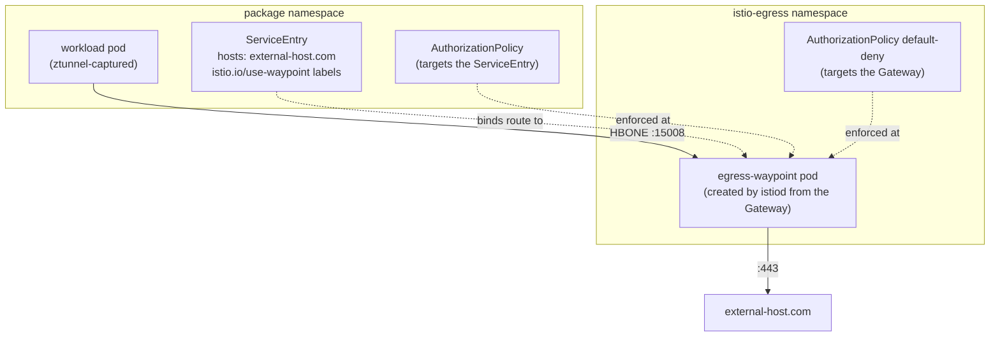

# Configuring an Egress Gateway (Ambient Mode)

Big Bang can deploy a shared egress gateway that packages bind their outbound
routes to: an
[ambient waypoint](https://istio.io/latest/docs/ambient/usage/waypoint/) in
the `istio-egress` namespace, deployed via the
[istio-egress-gateway](https://repo1.dso.mil/big-bang/product/packages/istio-egress-gateway)
package. This document assumes Istio ambient mode is already enabled
(`istio.ambient.enabled: true`); the egress gateway requires it (see
[Ambient mode only](#ambient-mode-only)).

Reasons to enable it:

- **A single exit point for external traffic:** package egress flows through
  one place instead of every pod reaching the Internet directly.
- **Default-deny egress authorization:** the waypoint denies all traffic
  except what each route's AuthorizationPolicy allows, enforcing per-host,
  per-source policy on mTLS workload identity, outside the client pod.
- **A registry replacement:** ambient mode drops sidecar mode's
  `REGISTRY_ONLY` guardrail; the waypoint restores (stronger) control over
  which external hosts are reachable. See
  [Restrictive NetworkPolicies are still critical](#restrictive-networkpolicies-are-still-critical).
- **Centralized observability:** egress traffic is visible in one waypoint's
  Istio telemetry rather than scattered across namespaces.

## Enabling

Enable the egress gateway:

```yaml
istio:
  egressGateway:
    enabled: true
```

`istio.egressGateway.enabled` automatically enables the `istioEgressGateway`
package (the package can also be enabled directly via
`istioEgressGateway.enabled: true`).

This deploys:

- The `istio-egress` namespace (labeled for ambient).
- The `istio-egress-gateway` HelmRelease, whose chart renders:
  - a Gateway API `Gateway` named `egress-waypoint` (`gatewayClassName:
    istio-waypoint`), from which istiod creates and manages the waypoint proxy
    pods; the chart deploys no workloads of its own,
  - a `ConfigMap` referenced via `infrastructure.parametersRef` that sizes the
    istiod-generated waypoint Deployment,
  - a default-deny `AuthorizationPolicy` attached to the Gateway.

### Complete example

Once the gateway is deployed, a package routes an external host through it by
declaring an outbound route in its bb-common values. For integrated Big Bang
packages the umbrella configures the default `egressGateway` (see
[Default waypoint binding for packages](#default-waypoint-binding-for-packages)):

```yaml
routes:
  defaults:
    outbound:
      # configured by the umbrella for integrated packages
      egressGateway: istio-egress/egress-waypoint
  outbound:
    external-host:
      enabled: true
      hosts:
        - external-host.com
      # ports default to HTTPS/443
```

From this route bb-common renders, in the package namespace: the ServiceEntry
(`external-host-external`) labeled with the `istio.io/use-waypoint` labels,
the AuthorizationPolicy (`external-host-external-egress`) targeting it and
admitting only this package's workloads, and a NetworkPolicy allowing HBONE
egress to the waypoint.



The ServiceEntry's waypoint labels make ztunnel tunnel traffic for
`external-host.com` over HBONE to the waypoint pod instead of sending it
directly out; the waypoint evaluates the attached AuthorizationPolicies
against its default-deny baseline and forwards the allowed traffic to the
external host.

## Restrictive NetworkPolicies are still critical

The waypoint only governs traffic that reaches it. Even with the egress
gateway enabled, an overly permissive egress NetworkPolicy (an allow-anywhere
rule, or a broad `443 → 0.0.0.0/0`) leaves arbitrary external
hosts reachable: NetworkPolicy matches IPs and ports, not hostnames, so any
rule wide enough to reach the Internet is a path around the waypoint, and
bypassed traffic never meets the default-deny baseline or the per-route
AuthorizationPolicies.

Nothing in the mesh backstops this: sidecar mode's `REGISTRY_ONLY`, which
refused to route traffic to undeclared hosts, has no ambient equivalent;
ztunnel passes unregistered destinations through untouched. It was never a
security boundary anyway: it ran in the client pod's own proxy and could be
bypassed by a compromised workload (see Istio's
[security note](https://istio.io/latest/docs/tasks/traffic-management/egress/egress-control/#security-note)).

The enforced boundary is NetworkPolicy. Keep package egress policies scoped so
external traffic has no path except HBONE (15008) to the waypoint; then its
default-deny baseline and per-route AuthorizationPolicies provide per-host,
per-source control stronger than `REGISTRY_ONLY` ever did.

## Ambient mode only

The egress gateway **requires ambient mode** (`istio.ambient.enabled: true`).
There is no sidecar-mode equivalent:

- The gateway is an ambient waypoint: its pods are created by istiod from a
  Gateway API resource and receive traffic over HBONE from ztunnel, neither of
  which exists in sidecar mode.
- All egress gateway templates are gated on ambient being enabled; with ambient
  off, nothing is deployed even if the egress gateway is enabled.
- The default waypoint binding passed to packages
  (`routes.defaults.outbound.egressGateway`) is automatically blanked when
  ambient or the egress gateway package is disabled, so ServiceEntries are
  never bound to a waypoint that does not exist. This matters because Istio
  fails open: traffic bound to a missing waypoint egresses directly instead of
  being blocked.

## Configuring the default egress gateway

### Default waypoint binding for packages

`routes.defaults.outbound.egressGateway` is the `<namespace>/<name>` waypoint
reference passed to every package that supports bb-common route defaults; each
package's outbound routes bind to it unless they set their own `egressGateway`:

```yaml
routes:
  defaults:
    outbound:
      egressGateway: istio-egress/egress-waypoint
```

The default matches the deployed package, so it normally does not need to be
changed. To bring your own waypoint managed outside of Big Bang, point this
reference at it and leave `istio.egressGateway.enabled: false`, but only when
that waypoint already exists, since a binding to a missing waypoint fails open.

Individual routes can opt out (`egressGateway: false`) or target a different
waypoint; see
[Egress Gateway (Waypoint) Binding](https://repo1.dso.mil/big-bang/product/packages/bb-common/-/blob/main/docs/routes.md#egress-gateway-waypoint-binding)
in the bb-common docs for the per-route contract.

### Waypoint sizing and behavior

Chart values pass through `istioEgressGateway.values`. The waypoint Deployment
is generated by istiod, so sizing is expressed as strategic-merge patches under
`waypoint.config` (supported keys: `deployment`, `service`, `serviceAccount`,
`horizontalPodAutoscaler`, `podDisruptionBudget`; HPA and PDB are only created
when set). The chart delivers these via the Gateway's
`infrastructure.parametersRef`; the upstream mechanism is described under
[Automated deployment](https://istio.io/latest/docs/tasks/traffic-management/ingress/gateway-api/#automated-deployment)
in Istio's Gateway API documentation. For example:

```yaml
istioEgressGateway:
  enabled: true
  values:
    waypoint:
      config:
        deployment:
          spec:
            replicas: 2
            template:
              spec:
                containers:
                  - name: istio-proxy
                    resources:
                      requests:
                        cpu: 500m
                        memory: 512Mi
                      limits:
                        cpu: 500m
                        memory: 512Mi
        podDisruptionBudget:
          spec:
            minAvailable: 1
```

The waypoint is shared by every bound route across all packages (a single
fate domain), so size it for the cluster's aggregate egress traffic.

Other chart values: `waypoint.name`, `waypoint.labels`/`annotations`,
`waypoint.listeners.port`, and `defaultDeny.enabled` (set `false` to drop the
default-deny baseline, leaving the waypoint open to any bound traffic). See the
[package documentation](https://repo1.dso.mil/big-bang/product/packages/istio-egress-gateway/-/blob/main/docs/overview.md)
for the full values reference.
