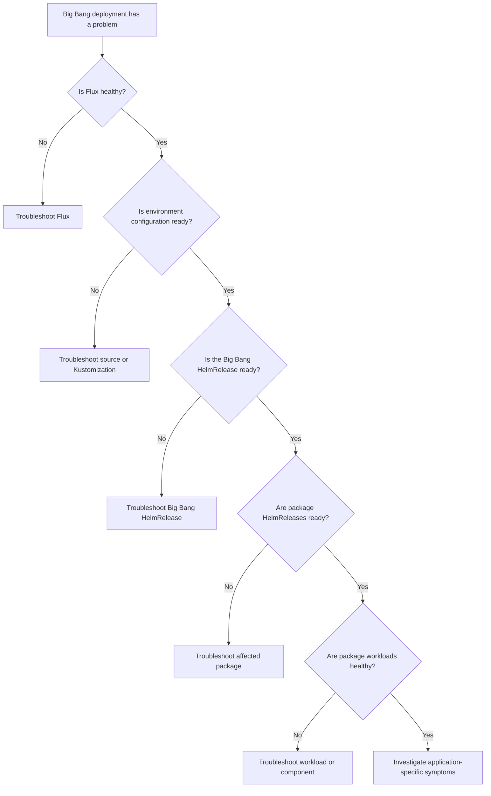

# Troubleshoot a Big Bang deployment

Use this guide when a Big Bang deployment, upgrade, or package is not healthy.

Big Bang is deployed declaratively through Flux. Find the **first resource that is not ready** and fix that failure before troubleshooting downstream resources. An earlier reconciliation failure can cause multiple downstream symptoms.

## Find the failing layer



Work from the highest failing layer downward. Avoid troubleshooting downstream symptoms while an earlier dependency is not ready.

## Check deployment status

Start by checking Flux and listing resources that are not ready:

```shell
flux check
flux get all -A --status-selector ready=false
```

If you need the complete reconciliation status:

```shell
flux get sources all -A
flux get kustomizations -A
flux get helmreleases -A
```

For a resource that is not ready, inspect its conditions, message, and recent events before moving to the next layer.

| Failing layer | Continue with |
| --- | --- |
| Flux controller or health check | [Flux](#flux) |
| Source or Kustomization | [Environment configuration](#environment-configuration) |
| Big Bang `HelmRelease` | [Big Bang HelmRelease](#big-bang-helmrelease) |
| Package `HelmRelease` or workload | [Package or workload](#package-or-workload) |
| Upgrade | [Upgrade problems](#upgrade-problems) |
| Healthy deployment with performance problems | [Performance troubleshooting](performance.md) |

## Troubleshoot by layer

### Flux

If `flux check` reports unhealthy controllers, resolve the Flux problem before troubleshooting Big Bang resources.

For controller health, logs, source failures, and other Flux-specific problems, see the [Flux troubleshooting guide](https://fluxcd.io/flux/cheatsheets/troubleshooting/).

### Environment configuration

Check the sources and Kustomizations that manage the environment:

```shell
flux get sources all -A
flux get kustomizations -A
```

If a Kustomization is not ready, inspect it:

```shell
kubectl describe kustomization <kustomization-name> -n <namespace>
```

Use the resource conditions and messages to identify source access, manifest build or apply, decryption, or dependency failures.

For detailed troubleshooting, see the [Flux troubleshooting guide](https://fluxcd.io/flux/cheatsheets/troubleshooting/) and [Flux Kustomization documentation](https://fluxcd.io/flux/components/kustomize/kustomizations/).

### Big Bang HelmRelease

If the Flux resources that manage the environment are ready, check the Big Bang umbrella `HelmRelease`:

```shell
flux get helmrelease bigbang -n bigbang
kubectl describe helmrelease bigbang -n bigbang
```

Use its conditions, reason, message, and events to identify failures involving Big Bang values, chart or source configuration, dependencies, or install and upgrade reconciliation.

Correct the declarative configuration that caused the failure. For detailed HelmRelease behavior and remediation, see the [Flux HelmRelease documentation](https://fluxcd.io/flux/components/helm/helmreleases/).

#### Reconcile after correcting the cause

Flux reconciles resources automatically. To trigger an immediate reconciliation after correcting the configuration:

```shell
flux reconcile helmrelease bigbang -n bigbang --with-source
```

Then verify the release:

```shell
flux get helmrelease bigbang -n bigbang
```

#### Full reset

A full reset is a **destructive recovery action that deletes the entire Big Bang deployment**. Before proceeding, confirm backup and persistent-data requirements and identify the Kustomization that will recreate the Big Bang `HelmRelease`.

Delete the Big Bang `HelmRelease`:

```shell
kubectl delete helmrelease bigbang -n bigbang
```

If namespaces remain stuck in a terminating state, use the [`remove-ns-finalizer.sh`](../../../scripts/remove-ns-finalizer.sh) script to remove the remaining finalizers.

After deletion completes, reconcile the Kustomization that manages the Big Bang `HelmRelease`:

```shell
flux reconcile kustomization <kustomization-name> \
  -n <namespace> --with-source
```

Verify that the deployment is recreated successfully:

```shell
flux get helmrelease bigbang -n bigbang
```

**Warning:** Removing namespace finalizers forces deletion to complete. Use the script only for namespaces that remain stuck during the full reset.
### Package or workload

After the Big Bang `HelmRelease` is ready, check the downstream package releases:

```shell
flux get helmreleases -A
```

Inspect a package that is not ready:

```shell
kubectl describe helmrelease <package-name> -n <namespace>
```

If the package release is ready but the application is not functioning, inspect its workloads:

```shell
kubectl get pods -n <namespace>
kubectl describe pod <pod-name> -n <namespace>
```

Use the reported conditions and events to choose the next step.

| Problem | Continue with |
| --- | --- |
| Pod is `Pending`, fails to start, or repeatedly restarts | [Kubernetes application debugging](https://kubernetes.io/docs/tasks/debug/debug-application/) |
| `ErrImagePull` or `ImagePullBackOff` | Inspect pod events and verify the image reference, registry access, and configured credentials |
| DNS failure | [Kubernetes DNS debugging](https://kubernetes.io/docs/tasks/administer-cluster/dns-debugging-resolution/) |
| Service has no reachable backend | [Kubernetes Service debugging](https://kubernetes.io/docs/tasks/debug/debug-application/debug-service/) |
| NetworkPolicy may be blocking traffic | [Big Bang Network Policies](https://docs-bigbang.dso.mil/latest/library-charts/bb-common/docs/network-policies/) |
| Istio routing, mesh, TLS, or authorization problem | [Istio diagnostic tools](https://istio.io/latest/docs/ops/diagnostic-tools/) |
| Big Bang authorization problem | [Big Bang Authorization Policies](https://docs-bigbang.dso.mil/latest/library-charts/bb-common/docs/authorization-policies/) |
| Big Bang route problem | [Big Bang Routes](https://docs-bigbang.dso.mil/latest/library-charts/bb-common/docs/routes/) |
| Admission failure | Use the documentation for the policy controller reported in the rejection |
| Resource, storage, or scheduling problem | [Kubernetes troubleshooting](https://kubernetes.io/docs/tasks/debug/) |
| Kubernetes resources are healthy but the application is not | Use the package-specific documentation |
| Deployment is healthy but slow or resource constrained | [Performance troubleshooting](performance.md) |

#### Check Service connectivity

If the problem involves Service connectivity, confirm that the Service has the expected EndpointSlices:

```shell
kubectl get svc <service-name> -n <namespace>

kubectl get endpointslice -n <namespace> \
  -l kubernetes.io/service-name=<service-name>
```

If the Service is expected to select workloads but has no endpoints, verify its selector and backing workloads.

For CNI, load balancer, or infrastructure failures, use the documentation for the components deployed in your environment.

**Warning:** Do not disable security policies, add broad allow rules, or manually modify Flux-managed workloads as a standard troubleshooting step. Correct the declarative configuration that caused the failure.

## Upgrade problems

Use the same top-down troubleshooting workflow on this page to find the first resource that is not ready.

For an upgrade failure, also review:

- Big Bang release notes and upgrade notices for the relevant upgrade path.
- The affected package's changelog.
- Required configuration or value changes.

Correct the desired configuration rather than using a direct `helm upgrade`, manually editing Flux-managed resources, or performing a direct Helm rollback as the first response.

For upgrade procedures, supported upgrade paths, and post-upgrade verification, see [Upgrades](../upgrades.md).

## Verify recovery

After correcting the failure, check for resources that are still not ready:

```shell
flux get all -A --status-selector ready=false
```

Then verify the affected workloads:

```shell
kubectl get pods -n <namespace>
```

Verify that the original symptom is also resolved. A successful reconciliation does not necessarily mean that the application is functioning correctly.

## Escalate the issue

If you cannot resolve the problem, collect information about the **first failing layer**.

Include:

- Big Bang version
- Affected package and version, if applicable
- First Flux resource that is not ready
- Resource condition and error message
- Relevant events or logs
- Recent configuration or upgrade changes
- Steps to reproduce the problem

Useful starting commands are:

```shell
flux get all -A --status-selector ready=false
kubectl get events -n <namespace> --sort-by='.lastTimestamp'
```

**Warning:** Review diagnostic output before sharing it. Logs, events, and resource information can contain environment-specific or sensitive information.

