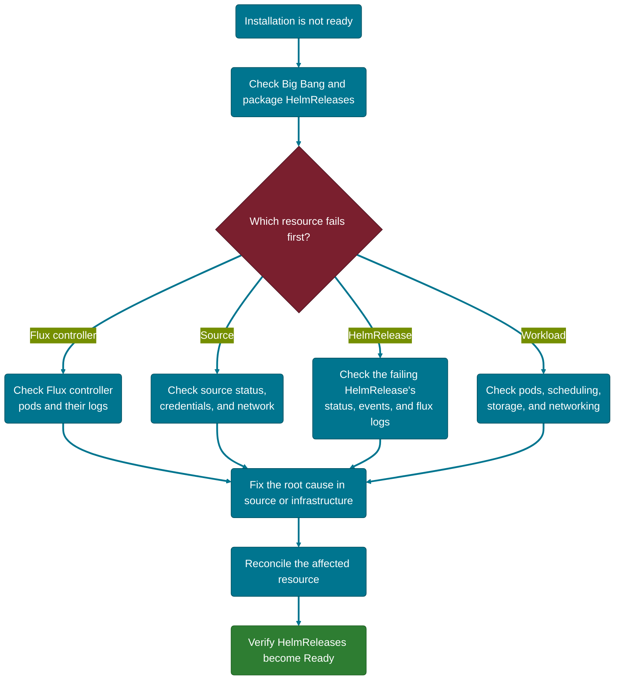

# Installation Troubleshooting

Use this guide when a **new Big Bang deployment does not complete successfully**. Start with the Big Bang `HelmRelease`, then follow the failing resource down the reconciliation chain.

If the failure is isolated to one of the following, use its dedicated guide instead:

- One integrated package — [Package Troubleshooting](packages.md)
- Connectivity or DNS — [Networking Troubleshooting](networking.md)
- Scheduling or capacity — [Performance Troubleshooting](performance.md)

These sections roughly follow the order a failure appears in — check the earliest applicable stage first, since an early failure often causes symptoms further down the chain:



## Diagnose the Installation

### 1. Check Big Bang and Package Status

```shell
kubectl get helmrelease bigbang -n bigbang
kubectl get helmreleases -A
kubectl get pods -n flux-system
```

A healthy installation requires the Big Bang `HelmRelease`, its package `HelmRelease` resources, and the Flux controllers to reconcile successfully.

If a resource is not ready, inspect its conditions and recent events:

```shell
kubectl describe helmrelease bigbang -n bigbang
kubectl get events -n bigbang --sort-by='.lastTimestamp'
```

For a package failure, replace `<package-name>` with the failing `HelmRelease`:

```shell
kubectl describe helmrelease <package-name> -n bigbang
flux logs --kind=HelmRelease --namespace bigbang --name <package-name>
```

### 2. Identify Where Reconciliation Failed

Use the status or error message to choose the next check.

| Symptom | Check |
| --- | --- |
| Big Bang or a package `HelmRelease` is not ready | Inspect the `HelmRelease` conditions and events. |
| `dependency ... is not ready` | Identify the dependency that is not ready and troubleshoot it first. |
| Git or Helm source cannot be fetched | Inspect the related `GitRepository`, `HelmRepository`, or `OCIRepository` and verify credentials and network access. |
| Values or schema validation fails | Correct the reported value, required field, or type mismatch in the source configuration. |
| Pods remain `Pending` | Check node capacity, scheduling constraints, and storage. |
| Images cannot be pulled | Verify registry connectivity and image-pull credentials. |
| Flux controllers are unhealthy | Check the controller pods and logs in `flux-system`. |

> **Tip:** Fix the first failing dependency instead of troubleshooting every downstream package. Dependent resources can remain unready until the earlier failure is resolved.

## Check Common Failure Points

### Flux Controllers

Confirm the controllers are running:

```shell
kubectl get pods -n flux-system
```

If a controller is unhealthy, inspect its logs:

```shell
kubectl logs -n flux-system deployment/source-controller
kubectl logs -n flux-system deployment/helm-controller
kubectl logs -n flux-system deployment/kustomize-controller
```

You can also run:

```shell
flux check
```

Resolve Flux controller errors before troubleshooting downstream package installations. See the [Flux troubleshooting cheatsheet](https://fluxcd.io/flux/cheatsheets/troubleshooting/) for additional controller-level diagnostics.

### Source Access

If Flux cannot fetch a source, inspect the resource named in the error:

```shell
kubectl get gitrepositories -A
kubectl describe gitrepository <repo-name> -n <namespace>
kubectl get events -n <namespace> --sort-by='.lastTimestamp'
```

Check for:

- Invalid or expired credentials
- Missing Kubernetes secrets
- DNS or network connectivity failures
- An incorrect repository URL, tag, branch, or reference

For Helm or OCI sources, inspect the corresponding `HelmRepository` or `OCIRepository` instead.

### Values and Schema Errors

The `HelmRelease` status normally reports validation or rendering failures:

```shell
kubectl get helmrelease bigbang -n bigbang -o yaml
```

Look under `status.conditions` for the specific error. Correct the source configuration rather than patching the generated resource in the cluster.

Common causes include:

- Invalid Big Bang values
- Missing required values
- Incorrect YAML types or structure
- Package values that are incompatible with the selected chart version

### Cluster Prerequisites

If workloads cannot schedule or infrastructure resources cannot become ready, confirm that the cluster satisfies the prerequisites for the Big Bang release you are installing.

```shell
kubectl get nodes
kubectl describe nodes
kubectl get storageclass
kubectl get pods -n kube-system
```

Check the [Prerequisites](../../getting-started/prerequisites.md) page for the current requirements, including Kubernetes compatibility, capacity, storage, DNS, ingress, and access to required external endpoints.

## Reconcile After Fixing the Cause

Flux reconciles resources automatically. To retry immediately after correcting the source configuration, reconcile the affected resource:

```shell
flux reconcile helmrelease <package-name> -n bigbang
```

For the top-level Big Bang release:

```shell
flux reconcile helmrelease bigbang -n bigbang
```

If the failure was caused by a Git source change, reconcile the source first:

```shell
flux reconcile source git <source-name> -n <namespace>
```

Then check the `HelmRelease` again. See the [Flux reconcile command reference](https://fluxcd.io/flux/cmd/flux_reconcile_helmrelease/) for the full set of reconcile options.

> **Note:** Reconciliation retries the desired state; it does not correct an invalid configuration. Fix the underlying source before repeatedly forcing reconciliation.

## Recover a Stuck Installation

### Partial Failure

When only one or a few packages fail, troubleshoot the earliest failed dependency and reconcile that resource after fixing the cause. Avoid deleting healthy package releases.

```shell
kubectl get helmreleases -A
```

Use `kubectl describe` or `flux logs` on the failing release to determine the root cause.

### Full Reset

Deleting the Big Bang `HelmRelease` is a **destructive recovery action**, not a standard troubleshooting step. It can remove resources managed by the release and may affect application data depending on the package and storage configuration.

Before resetting an installation:

1. Confirm the failure cannot be corrected through the declarative source configuration.
2. Review persistent-data and backup requirements.
3. Confirm how the environment recreates the Big Bang `HelmRelease`.

If a reset is required:

```shell
# Delete the Big Bang HelmRelease
kubectl delete helmrelease bigbang -n bigbang

# Reconcile the Git source to trigger recreation
flux reconcile source git <source-name> -n flux-system
```

This assumes your environment recreates the HelmRelease automatically from Git once it's deleted. Confirm that applies to your deployment before proceeding — if it doesn't, follow your environment's own deployment procedure to redeploy Big Bang instead.