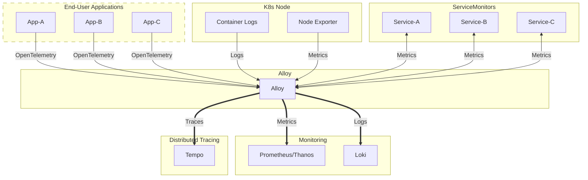

# Grafana Alloy

## Overview

[Grafana Alloy](https://grafana.com/docs/alloy/latest/), formerly known as
Grafana Agent, is Grafana's opinionated spin of the OpenTelemetry collector. It
combines many open-source projects in the cloud-native observability space with
the goal of being the only observability component necessary to collect and
distribute telemetry signals within a cluster.



## Big Bang Touchpoints

### Cortex Tenant remote write

Big Bang can send metrics discovered through ServiceMonitors and PodMonitors from
Alloy through the separately deployed Cortex Tenant package to Mimir. Enable
`alloy.cortexTenant` when that proxy should be Alloy's metrics destination:

```yaml
alloy:
  alloyMetrics:
    enabled: true
  cortexTenant:
    enabled: true
    tenant: my-tenant

monitoring:
  prometheusMetrics:
    enabled: false
  values:
    upstream:
      prometheus:
        enabled: false

addons:
  mimir:
    enabled: true
```

Deploy Cortex Tenant separately as `packages.cortex-tenant`; it is not a built-in
umbrella package. The proxy's default backend is the Mimir distributor. With
`alloy.cortexTenant.enabled`, the umbrella sends Alloy's operator-object metrics
only to the proxy at `http://cortex-tenant.cortex-tenant.svc.cluster.local:8080/push`.
It does not also write those metrics directly to Prometheus or Mimir. When the
custom package is enabled in the same umbrella release, Alloy waits for its
HelmRelease.

The proxy requires a `tenant` label on every series. Set
`alloy.cortexTenant.tenant` for one shared tenant, or leave it empty only when
all scraped series already carry their intended tenant labels. Configure
`alloy.cortexTenant.url` and matching network policies if the proxy uses a
different Service. For environments that disable the Prometheus workload, the
umbrella also disables the upstream control-plane ServiceMonitors by default;
operators who supply independent scrape credentials can enable them explicitly.

### Licensing

Grafana Alloy is open-source,
[licensed under Apache 2.0](https://github.com/grafana/alloy/blob/main/LICENSE).

### UI

While Grafana Alloy does expose a
[UI for visualizing its configuration status](https://grafana.com/docs/alloy/latest/troubleshoot/debug/),
it is not necessary for use and is not exposed by default within Big Bang.

### Storage

Grafana Alloy requires no storage itself, opting instead to push telemetry
signals to other cluster components like Loki and Tempo, which have their own
storage needs.

### Logging

Grafana Alloy writes its logs to stderr. These logs will be picked up by the
logging collector configured within the cluster.

### High Availability

Grafana Alloy supports multiple deployment modes with built-in clustering.
Depending on which features are enabled in the `k8s-monitoring` chart, Alloy
may be deployed as a `StatefulSet`, `DaemonSet`, or `Deployment`.

### Health Checks

Grafana Alloy is configured with standard liveness and readiness probes. In
addition to the health of Alloy itself, cluster administrators can view the UI
mentioned above for specific health statuses of individual Alloy
[components](https://grafana.com/docs/alloy/latest/get-started/components/).
