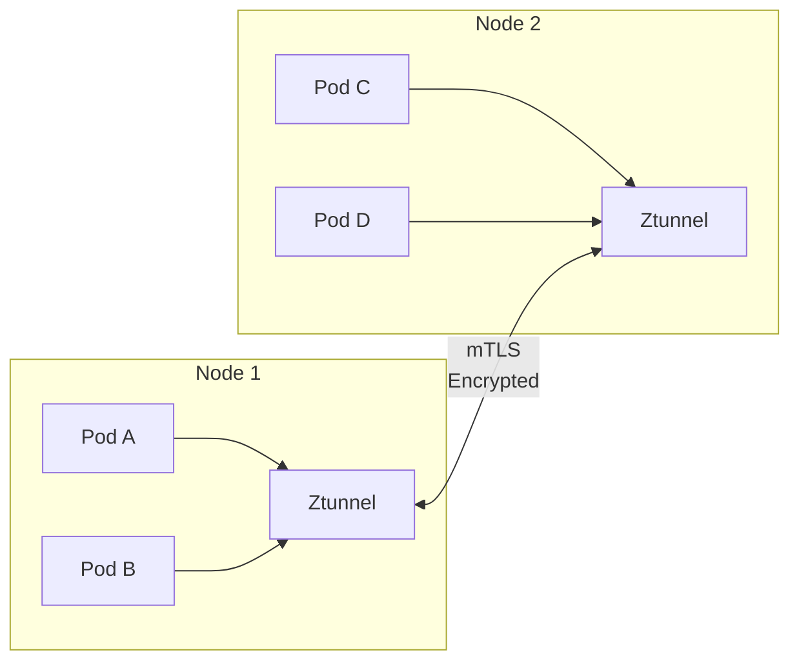

# Ztunnel

## Overview

[Ztunnel](https://istio.io/latest/docs/ambient/overview/) (zero-trust tunnel) is a purpose-built component for Istio's ambient mesh mode. It provides a lightweight, shared proxy that handles Layer 4 (L4) traffic between workloads, enabling mutual TLS (mTLS) encryption and zero-trust security without requiring sidecar proxies.

Ztunnel runs as a DaemonSet on each node and transparently intercepts and encrypts traffic between pods, providing secure communication at the network layer. This approach offers a simpler deployment model compared to sidecar-based service mesh architectures.



## Big Bang Touchpoints

### Licensing

Ztunnel is part of the Istio project and is open source, licensed under the [Apache License 2.0](https://github.com/istio/ztunnel/blob/master/LICENSE).

### Installation

Ztunnel is deployed to the `istio-system` namespace. It can be enabled explicitly or is automatically enabled when `ambient: true` is set in Big Bang values:

```yaml
# Explicit enable
ztunnel:
  enabled: true

# Or via ambient mode (auto-enables ztunnel)
ambient: true
```

### Storage

Ztunnel does not require any persistent storage. It operates as an in-memory L4 proxy.

### UI

Ztunnel does not have a dedicated UI. Observability is provided through:

- **Kiali**: Visualize mesh traffic and ztunnel connectivity
- **Grafana**: View ztunnel metrics via Prometheus
- **Kubectl**: Inspect ztunnel pods and logs

### Logging

Ztunnel logs are captured by the cluster's logging collector (Alloy or Fluentbit) and shipped to your configured logging backend (Loki or Elasticsearch).

### Monitoring

Ztunnel exposes metrics on port `15020` and includes Prometheus annotations for discovery:

```yaml
prometheus.io/scrape: "true"
prometheus.io/port: "15020"
```

**Note:** Ztunnel does not create a ServiceMonitor or PodMonitor. Metrics scraping relies on Prometheus being configured for annotation-based pod discovery. When using the Big Bang monitoring stack, ensure your Prometheus configuration includes pod annotation discovery for the `istio-system` namespace.

Key metrics exposed include:

- Connection counts and throughput
- mTLS handshake statistics
- Error rates and latency

### Health Checks

Standard Kubernetes readiness and liveness probes are configured for ztunnel pods.

### High Availability

Ztunnel runs as a DaemonSet, ensuring one instance per node. This architecture provides inherent high availability as traffic can be routed through any available ztunnel instance.

### Dependent Packages

Ztunnel requires the following packages:

- **istiod**: The Istio control plane that configures ztunnel
- **istio-cni**: Required for traffic interception in ambient mode

Optional but recommended:

- **Gateway API**: Provides the CRDs for configuring traffic routing in ambient mode
- **Kiali**: Visualization and management of the ambient mesh
- **Monitoring**: Metrics collection and dashboards

### Configuration

Values can be passed through to the ztunnel chart:

```yaml
ztunnel:
  enabled: true
  values:
    # Upstream chart values go here
    upstream:
      ambient:
        enabled: true
```

### Ambient Mode

To enable full Istio ambient mode with ztunnel, configure Big Bang with:

```yaml
ambient: true
istiod:
  enabled: true
istioCNI:
  enabled: true
```

This will automatically enable and configure Gateway API and ztunnel with the appropriate settings.
