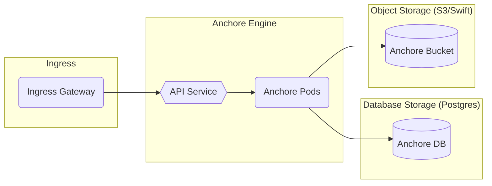
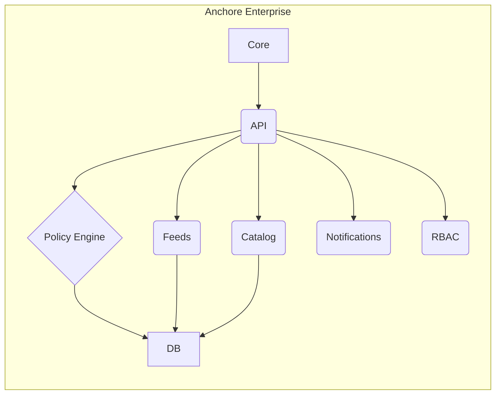

# Anchore

## Overview

[Anchore](https://anchore.com/) is a Docker container static analysis and policy-based compliance system that automates the inspection, analysis, and evaluation of images against user-defined checks to allow high confidence in container deployments by ensuring workload content meets the required criteria.

Anchore offers several [open source tools](https://anchore.com/opensource/) and products, however, this document will cover the architectural touch points for the Big Bang Anchore package, which includes Anchore Engine (open source) and Anchore Enterprise (requires enterprise license). For more information on the differentiators between Anchore's open source and commercial offerings, see [here](https://anchore.com/pricing/).

### Anchore Engine

### Anchore Enterprise

For more information on the Anchore Enterprise architecture, see [Enterprise Service Overview and Architecture](https://docs.anchore.com/current/docs/overview/architecture/).

## Big Bang Touch Points

### Licensing

Big Bang does not provide a license for Anchore Enterprise. You must procure a license from Anchore and provide it in your values when enabling the `anchoreEnterprise` addon.

### Configuration

Key configuration options for `anchoreEnterprise` in Big Bang include:

* `addons.anchoreEnterprise.enabled`: Set to `true` to deploy Anchore Enterprise.
* `addons.anchoreEnterprise.enterprise.licenseYaml`: Provide your Anchore Enterprise license key here.
* `addons.anchoreEnterprise.database`: Configuration for the PostgreSQL database. Big Bang can deploy a database for you, or you can connect to an external one.
* `addons.anchoreEnterprise.sso`: Configure SSO integration (e.g., with Keycloak).
* `addons.anchoreEnterprise.git`: Configure Git repository for the Helm chart if not using the default Helm repository.

### Istio Integration

If Istio is enabled in your Big Bang deployment, VirtualServices and Gateways will be automatically configured for Anchore Enterprise UI and API access.

### Monitoring

If Prometheus and Grafana are enabled (via the `monitoring` package), ServiceMonitors will be created to scrape metrics from Anchore Enterprise components.
