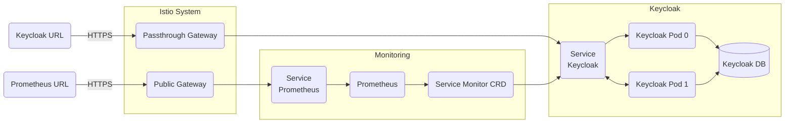

# Keycloak

## Overview

[Keycloak](https://www.keycloak.org/) provides open source identity and access management for modern applications and services.  This document will cover the architectural touchpoints for the Big Bang Keycloak package, which has been extended to include customizable registration and group segmentation.

### Keycloak Architecture



## Integration with Big Bang

Big Bang's integration with Keycloak requires special considerations and configuration compared to other applications. This document will help you set it up.

## Configuration

See [Keycloak Configuration](https://repo1.dso.mil/big-bang/product/packages/keycloak/-/blob/b16ef3a142d31a9339811022f5d2bd1664b92f0b/docs/configuration.md) in the Big Bang Keycloak Helm chart repo for help configuring the following:

* TLS Certificates
* Custom Admin Password
* Registration Plugin
* Keycloak Helm values

## Big Bang Touch-points

### GUI

Keycloak has two main end point URLs:
<https://keycloak.yourdomain.com> for authentication.
<https://keycloak.yourdomain.com/auth/admin> for administration.

The `yourdomain.com` domain name can be customized by setting the value `domain` in Big Bang's `values.yaml`

### Database

An external shared database is required for Keycloak operation in production.  It should be setup according to [the Keycloak database configuration documentation](https://www.keycloak.org/server/db).

> For development and testing, a Postgres database is provided inside the cluster.  This should **NOT** be used in production.

The following values can be customized in Big Bang's `values.yaml` to connect to your external database:

```yaml
addons:
  keycloak:
    values:
      database:
        hostname: yourdb.yourdomain.com
        vendor: postgres
        port: 5432
        database: keycloak
        username: kcuser
        password: p@ssw0rd
```

### Logging

Logging is automatic for Keycloak when the Logging package is enabled in Big Bang.  Fluentbit captures the logs and ships them to Elastic.

### Monitoring

When the Monitoring package is enabled, Big Bang will turn on Keycloak's production of Prometheus metrics and set up a Service Monitor to scrape those metrics.  By default, metrics for the `datasources` (db), `undertow` (http), and `jgroup` subsystems are enabled.

### Health Checks

Liveness and readiness probes are included in the Keycloak Helm chart for all deployments. The probes check the endpoint at `/auth/realm/master/` on port 8080 of the pods.  This means the probes will still succeed even if you have an invalid certificate loaded into Keycloak.

If you wish to adjust the probes, you can override the values in `values.yaml`:

```yaml
addons:
  keycloak:
    values:
      livenessProbe: |
        httpGet:
          path: /auth/realms/master
          port: http
          scheme: HTTP
        initialDelaySeconds: 120
        failureThreshold: 15
        periodSeconds: 15
      readinessProbe: |
        httpGet:
          path: /auth/realms/master
          port: http
          scheme: HTTP
        initialDelaySeconds: 120
        failureThreshold: 15
        timeoutSeconds: 2
```

## Licensing

Keycloak is available under the [Apache License 2.0](https://github.com/keycloak/keycloak/blob/master/LICENSE.txt) for free.

## High Availability

By default, Big Bang deploys Keycloak with two replicas in a high availability cluster configuration.  It is already configured to support cache sharing, anti-affinity, fail-overs, and rolling updates. If you wish to increase or decrease the number of replicas you must first make sure you are pointed to an external database, and then the replicas can be increased, all of which can be set in `values.yaml`:

```yaml
addons:
  keycloak:
    database:
      host: ""
      type: ""
      port: ""
      database: ""
      username: ""
      password: "in-encrypted-values"
    values:
      replicas: 3
```

The Keycloak package also comes with a HorizontalPodAutoscaler resource which can be enabled. Enabling the HPA will overwrite the `replicas` key shown above:

```yaml
addons:
  keycloak:
    values:
      autoscaling:
        enabled: true
        minReplicas: 2
        maxReplicas: 4
```

## Dependent Packages

- Istio for ingress
- (Optional) Monitoring for metrics
- PostgreSQL database (development/test only)
