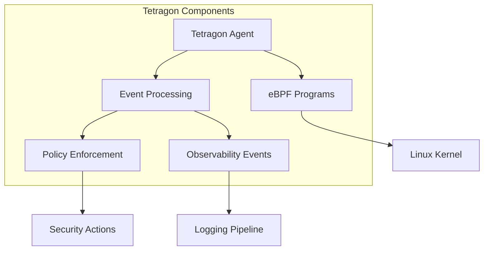

# Tetragon

## Overview

[Tetragon](https://tetragon.io) is an eBPF-based security observability and runtime enforcement tool. It provides deep visibility into running workloads by using eBPF to observe system calls, network traffic, and other kernel events, enabling real-time security monitoring and policy enforcement at the kernel level.

## Architecture

Tetragon operates using eBPF programs loaded into the Linux kernel, with components that include:

The Tetragon agent runs as a privileged DaemonSet on each node, loading eBPF programs into the kernel to monitor system activity.

## Big Bang Touchpoints

### Security Considerations

Tetragon requires privileged access to the host system to:
- Load eBPF programs into the kernel
- Access system calls and kernel events
- Monitor network traffic
- Set kernel probes (kprobes)

This is reflected in the Kyverno security policy exceptions for:
- Host namespace access
- Privileged containers
- Root user requirements
- Host path mounts

### Logging

Tetragon generates detailed security events that can be:
- Forwarded to the cluster logging pipeline (if enabled)
- Stored locally on nodes
- Streamed via API endpoints

### Monitoring

When monitoring is enabled, Tetragon exports metrics about:
- Security events and detections
- eBPF program performance
- System resource usage

These metrics can be scraped by Prometheus and visualized in Grafana.

### High Availability

Tetragon runs as a DaemonSet ensuring:
- One agent per node for complete cluster coverage
- Automatic scaling as nodes are added/removed
- Resilience to individual node failures

The DaemonSet uses node affinity and tolerations to ensure proper placement on all node types.

## Configuration

See the downstream chart for configuration [here](https://repo1.dso.mil/big-bang/apps/sandbox/tetragon)

